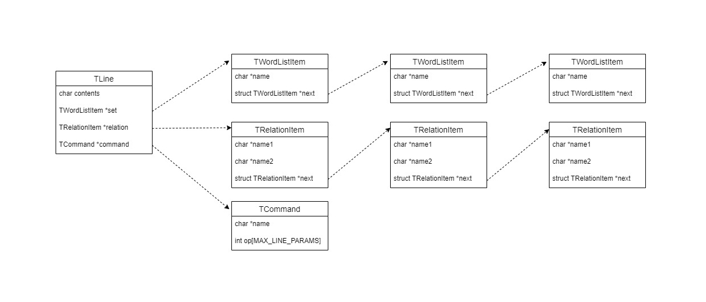

# VUT IZP project 2 (2021/2022)

So this is my, or maybe I should say our first group project in the first degree of **BUT FIT bachelor's degree**.

The basic motivation (except to pass the semester) was to learn how to work with data structures, reading and processing files in `C`.

The goal of this project was to implement all the functions from the subject of discrete mathematics to a single-file program. The functions included working with universum, sets, relations and commands which represent the functions of discrete mathematics (*surjectivity*, *transitivity*, *reflexivity*, etc.).

## Authors

- [MOONYROS](https://github.com/MOONYROS) (xlukas15)
- [Kumismar](https://github.com/Kumismar) (xkouma02)
- [Petanna](https://github.com/Petanna) (xdudov02)
- [mikkina](https://github.com/mikkina) (xfukar00)

## Basic structure of the program

In this part of the README, I would like to focus on describing how the program works.

### File input

This program was supposed to take the name of the file in the argument section from the command line (that means in **UNIX**, the program was meant to be run like `./setcal <filename>`) where filename is a name of the file, where the results will be written. I think that not much more description is needed for this part of the program...

### Data structures

As it was one of the main goals, it should be no surprise that the first thing I started working on were the structures.

There were **4 structures** I used. One was meant to contain all the information about a single line `.txt` file:

- **contents** - information about what is the first letter in the line. It could be `U`, `S`, `R` or `C`
- ***set** - pointer to `TWordList` structure
- ***relation** - pointer to `TRelationItem` structure
- ***command** - pointer to `TCommand` structure

Then there were the other three structures that were aimed to work with a certain type of line (*set*, *relation* or *command*). These were recongnised by the first character (contents) in the line. To give a graphic explanation (which is in my opinion better for this case) I'll use a diagram model of these four structures:

### Basic explanation of the process

First of all, I'll call the `processFile()` function that basically reads the whole file and after that, all the lines are divided into the structures (each line could be set, relation or command) using the `processLine()` function.

 I'm also checking whether the first line in the text file has `U` letter first. The `U` tells us that it's a universe that always has to be on the first line of the file. To explain it a little bit more, its main purpose is to contain all the elements that are used in the file and it can also be used as a regular set, so that way user can work with it as well.

Then the program will process the other lines and after that it takes care of the commands using `processCommands()`. To give a basic explanation of the commands, all of them have some sort of a result that they write on the **stdout**. Their result can be a **bool value** (written on output as `true`/`false`) (e.g. empty or bijective functions), a **set** (like domain or intersect) or a **relation** (closure_sym, closure_ref, closure_trans). Also, there is a bonus function that only prints one letter on the standard output.

## Result

Rating of this project is 14/14 +1 bonus point.
